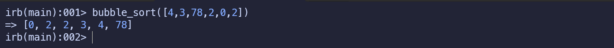

# The Bubble Sort algorithm

## About the algorithm

This algorithm is written in Ruby, the goal of this algorithm is to practice some concepts while I was exploring in Ruby.

> [!IMPORTANT]
> I advise people to not use this algorithm in an production application

## About Bubble Sort

"Bubble sort, sometimes referred to as sinking sort, is a simple sorting algorithm that repeatedly steps through the input list element by element, comparing the current element with the one after it, swapping their values if needed. These passes through the list are repeated until no swaps have to be performed during a pass, meaning that the list has become fully sorted. The algorithm, which is a comparison sort, is named for the way the larger elements "bubble" up to the top of the list."

    <a href="https://en.wikipedia.org/wiki/Bubble_sort">Wikipedia contributors. (2025, April 25). Bubble sort. Wikipedia.</a>

## Cloning and installation

Clone this repository to your local machine. To do this, click on the green "Code" button at the top right of list of files and copy the link in the prompt. Then, run the following command in your terminal:

    git clone <link>

This will create a folder called 'bubble_sort' inside the directory you ran the command in.

CD into that folder:

    cd bubble_sort

Now before beginning work on the exercises, you'll want to install a gem called RSpec. RSpec is a popular Ruby testing framework that is used in this repository to provide you with tests that check your solutions.

To install RSpec, run the following command in your terminal:

    gem install rspec

You should see a message that says something along the lines of "6 gems installed" in your terminal. Verify that the installation was successful by simply running the following command:

    rspec

## Usage

There are two ways to try out this algorithm.

### 1 - Directly in interactive ruby console (IRB)

    irb -r ./lib/bubble_sort.rb

From there on you can type directly the name of method in the bubble_sort file:

    bubble_sort

The method is prepared to receive one input.

    1 - An array of numbers

Check out the images below

### 2 - Unit tests execution

Once within the bubble_sort cloned directory, you can type directly

    rspec

It runs all unit tests prepared for the bubble_sort method.

Check out the image below

## Support

There is no support provide for this algorithm

## Contributing

The repository does not accept contribution due to the fact it was rehearsal

## License

A short and simple permissive license with conditions only requiring preservation of copyright and license notices. Licensed works, modifications, and larger works may be distributed under different terms and without source code. [MIT](LICENSE)
